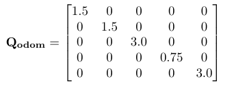

# About 
This repo exists to showcase an Extented Kalman Filter I implemented during my co-op at Wato.  
The repo contains the ros2 package for the EKF and also contains a breif write explaning  
the process of making designing and making your own EKF. 

# <center>A Novice's Guide to Designing An <br /> Asynchronous Extended Kalman Filter</center>

<p align="center">
  
</p>


## Background and Motivation

Before I talk about what an Extended Kalman Filter (EKF) is, it’s better to first ask: why do we even need one?

If you’ve ever used motor encoders to measure distance, you know a common problem is that the encoder measurements become inaccurate over time. This is an inherent issue when we try to deterministically estimate our state. The Extended Kalman Filter addresses this through a probabilistic approach. The basic idea of the EKF is that it uses a model to propagate the state forward in time, then incorporates sensor data and our understanding of uncertainty to produce a better state estimate through a weighted average.

## Introduction

The EKF is a sensor fusion algorithm based on the Bayes filter, a mathematical framework for estimating an unknown probability distribution using a process model and incoming measurements. The Kalman Filter is a special case of the Bayes filter and serves as an optimal estimator for systems that are linear and where all uncertainties are modeled as Gaussian (normally distributed). The Extended Kalman Filter takes this idea further by allowing us to apply the Kalman Filter to non-linear systems. This is achieved by linearizing the non-linear process and observation models around the current estimate. This allows it to apply Kalman Filter techniques in a locally linear approximation of the system.


Lines 1 and 2 are the prediction step, while lines 3 to 5 are the correction step. In line 1, we use our prediction function g, which is our process model, to predict what we believe the next state will be, given the previous state and the current control inputs. Next, the predicted covariance $\bar{\Sigma}_t$ calculated using the previous covariance and G, which is the Jacobian of the process model. Then we add the process noise. In the correction step, line 3, we calculate the Kalman gain. The Kalman gain is essentially a weighting that biases the corrected state either toward the observation or the prediction. It’s calculated using the predicted covariance, the Jacobian of the observation model, and the sensor noise term Q. On line 4, the state at time t is calculated using the predicted state, and we add the difference between the predicted and observed state, scaled by the Kalman gain. Finally, on line 5 the new covariance at time t is calculated.


To build better intuition for what's happening, it's better to look at the problem from a statistical standpoint. We start with a higher-dimensional Gaussian, pass it through a linearized function, and the covariance grows. Then we multiply the Gaussian we got from our function with the observation Gaussian, and the result is a new Gaussian distribution. The covariance shrinks (ideally), and the mean becomes a weighted average between the prediction and the observation. That new mean becomes our updated state.

## Implementation Details

### Defining The Objective Of Our EKF

Before we go and design an EKF, it is important to understand where in our state estimation stack the EKF is and what goals we have for it.  For my project, I had to design an EKF for a car-like/Ackermann steering robot with motor encoders, an IMU, and LiDAR. However, if you are  designing an EKF for a different type of robot with different sensors, the process of designing will be much the same, but your equations and motion models will look different.

My Robot's State Estimation Articture :  


As you can see in the diagram, I have three parts in my state estimation: the Odometry, the EKF, and the Particle Filter. The job of the EKF in my architecture is to incorporate the IMU data into the odometry data. The odometry is fairly accurate at keeping track of velocity and position in a straight line, but it struggles to handle changes in direction or maintain the robot's orientation. This is where the IMU comes in handy. When calibrated properly, the IMU can track orientation very well. The goal of the EKF is to fuse the IMU data with the odometry to correct for orientation, as well as fuse the control input velocity with the odometry velocity to get a good estimate of the robot's actual velocity. We do not need to worry too much about the x and y accuracy from the EKF, since the Particle Filter will take care of most of the heavy lifting in that department.

### Defining the state vector ($\mu_t$) and motion model $g(\mu_{t-1}, u_t)$

The state vector will be as follow :  


prediction function $g(\mu_{t-1}, u_t)$ and control input :  


The state vector consists of the following quantities : $x$, $y$, ${\theta}$, $v$, $\dot{\theta}$, $a_x$, $a_y$. x, y and $\theta$ make up the robots pose, they are inputs that need to be fed into the particle filter. Additonly, $v$ is need by the cars safety system to calculate accurate collision times to prevent unnessary collison. We keep track of the rest of the quantities as they help enhance our other predictions. 

The control inputs for the robot are velocity and steering angle, so they are used to drive the state forward in time. The motion model or prediction function $g$ is an implementation of the Ackermann kinematics using the tricycle model. This model is fairly simple but captures the motion of the vehicle well enough for our use case. Additionally, the main assumption made in the model is that the vehicle moves with constant acceleration along arcs.

### Defining the Jacobian $G$


$G$ is is the Jacobain / slope of the motion model $g$. It is a nesscary part of the Extended Kalman Filter, as it helps us linearize our non linear function so that we can appply the Kalman Filter framework to them. I recomend using Software such as matlab or octave to calculate this for you, as getting it wrong can seriously affect your EKF

### Multiple Sensor Models and Asynchrony

This is where things diverge a little from other guides. Generally, most other sources I found online talk about the single-sensor case for the EKF, but gloss over how to implement a multi-sensor version. Thus, I will try my best to explain the process. To start out, we must first define the motivation for asynchronous multi-sensor EKF. Given we have two sensors, a common strategy that is often employed is to bundle all the sensor information into one correction step. However, this can be rather inefficient, as you will either end up wasting sensor information (in the case of having a high-frequency sensor and a low-frequency one) or using stale sensor information (incorporating outdated data, leading to poor correction). To remedy this, we will use one sensor model per sensor. This way we can have a higher update rate for our EKF and improve performance by only using the most current data. The basic idea will be to predict when we have new control inputs and accept the predicted state and covariance as the estimated state, while also storing the control inputs. Next, when new sensor information arrives, we predict again from the time we last updated to the arrival of the sensor data using the stored control inputs, then perform the correction step with the correct sensor model.

### IMU Sensor Model

Imu Sensor Model : 


Imu Jacobian H : 


The IMU sensor model has the following: theta, theta_dot, ax, and ay. This is the primary way we correct for orientation in the EKF through the help of the IMU. I decided not to integrate the linear accelerations to find the body velocity, as that measurement would accumulate significant error from integrating over time. Additionally, this would require extra computation, since the H matrix for the IMU would need to be computed at every correction step. Therefore, I chose not to use it.

### Odometry Sensor Model

Odom Sensor Model : 


Odom Jacobian H : 


The odom sensor model has the following: $x$, $y$, ${\theta}$, $v$ , and $\dot{\theta}$. The primary role of odom in the EKF is correcting the velocity prediction. In addition, it also provides corrections for $x$, $y$, $theta$, and $\dot{\theta}$. However, the other measurements are not very reliable. Since our only sources of x and y are not very accurate and drift over time, the EKF state for x and y will also drift over time.

### Process noise, Sensor noise, and Inital Covariance 

Process noise : 


Imu sensor noise matrix : 


Odom sensor noise matrix : 



Inital Covariance ${\Sigma}_t$ :   


The covariance tells us how certain we are about a measurement. A large value indicates low certainty in the quantity, while a small value indicates high certainty. However, we never want the covariance in our filter to drop to 0, as that could cause the filter to collapse.

We start the initial covariance at 10.0 for all the state variables, since we want the initial values to get flushed out. Although we can experimentally determine the covariance values, it is usually easier to tune them through testing. My strategy is to assume a baseline covariance value of 1.0, then increase or decrease it depending on how certain each measurement is relative to that baseline.

The process noise for $x$, $y$, and $v$ is set to 1.0, as the model does a relatively good job of representing the robot’s linear motion. However, the model struggles to describe turning movements because it cannot account for wheel slip and slip angle. For this reason, we assign a covariance of 5.0 to $\theta$ and $\dot{\theta}$.

Similarly, for the same reasons, we assign $a_x$ and $a_y$ a covariance of 3.5 in the process model. The IMU sensor noise values are lower than those of the process model across all metrics, since the IMU is a fairly reliable source of information for $\theta$, $\dot{\theta}$, $a_x$, and $a_y$.

The odometry sensor noise values are lower than the process model for certain metrics such as $x$ and $y$, but higher than the IMU noise for $\theta$ and $\dot{\theta}$, as the encoders do not handle those measurements very well.

### Improving Numerical Stability

One of the under-discussed topics in most guides is numerical stability, so I will go over some techniques to address it.

List of techniques: 

1. Avoid direct matrix inversion when computing the Kalman gain.

Direct inversion is numerically unstable. Instead, use an LLT or LDLT solver, as these are much more stable.

incorrect example : 
```
matrix5d S = H_odom * result.new_covariance * H_odom.transpose() + Q_odom;
S = S.inverse();
matrix5x7d K = result.new_covariance * H_odom.transpose() * S;
```

Better (LLT solver, with LDLT as a fallback):

```
matrix4d S = (H_imu * current_predition.sigma_t * H_imu.transpose() + Q_imu).eval(); //inovation covariance
S = (0.5 * (S + S.transpose())).eval(); //correct the matrix scew 
Eigen::LLT<matrix4d> llt (S);
matrix7x4d K;
K = (current_predition.sigma_t * H_imu.transpose() * llt.solve(matrix4d::Identity())).eval();
```

2. Correct matrix skew after operations.

Sometimes, due to floating-point errors, a covariance matrix may lose its symmetry. To fix this, you can symmetrize it:

```
sigma_predicted = (0.5 * (sigma_predicted + sigma_predicted.transpose().eval())).eval();
```

3. Prevent covariance values from collapsing to zero.

After covariance updates, there is a chance that a diagonal element becomes zero or negative. If this happens, the filter may collapse. To avoid this, add a small jitter (artificial uncertainty):

```
if (new_sigma_t.diagonal().minCoeff() <= 0) {
    new_sigma_t.diagonal().array() += 1e-8;
}
```

4. use Jacobs formula for calculating the the new ${\Sigma}_t$  

when using the standard formula for calculating ${\Sigma}_t$, there is a chance that it can colapse. so it better to use Jacobs Method :  


example code : 

```
matrix7d A = (matrix7d::Identity() - K * H_odom).eval();
matrix7d new_sigma_t = (A * current_predition.sigma_t * A.transpose() + K * Q_odom * K.transpose()).eval();
```

## Results and Discussion

The method used to produce the following results was to drive the car around the simulated miniature Porto track at race pace using a gamepad for 5 laps at "qualifying pace." It produced the following results:

Velocity Data over 5 laps :  


Yaw Angle Data over 5 laps :  


When looking at the velocity data, we can see three distinct lines. If we examine the velocity data from the wheel encoders, we can observe that the velocity is roughly accurate but spikes a lot and deviates from the actual velocity quite frequently. However, when we look at the EKF velocity in green, it is much closer to the actual velocity. It does diverge from it occasionally, but it is still a much better estimate of the velocity.

If we look at the yaw data, we can see that by the time 5 laps are finished, the odometry yaw has significantly drifted from the actual yaw angle. When we examine the EKF yaw data, we can see that it is jumping between the actual yaw value and the odometry yaw value. This is to be expected, as when the EKF performs an odometry update step, the yaw gets closer to the odometry value, while during an IMU update step, it gets closer to the actual yaw value. Thus, we see the zig-zagging behavior. On average, the yaw value is closer to the actual yaw, accomplishing the objective of the EKF.

## Conclusion and Reflection

Overall, the filter's performance is within expectations. It doesn't drastically improve the accuracy of the x and y coordinates; however, the theta and velocity estimation is much improved. This achieves the initial goals set when building this filter. However, there are still areas where the filter could be much improved.  

When looking at the motion model, it is rather simplistic and can capture the motion of the robot. However, when slip is introduced into the equation or fast heading changes occur, the model can't fully capture the robot's motion, as it has no idea of the full system dynamics. This could be improved with a better model, but that would also require more compute. Additionally, my current understanding of vehicle dynamics is also limited, thus further limiting this area. 

Another area where the filter is lacking is not being truly async. The current design uses the ROS2 sequential executor, so the callback functions happen in sequence, rather than truly concurrently. This could be remedied by switching to the concurrent  executor, but given the time frame in which this filter was developed and my understanding of concurrency, this was not feasible.  

Overall I am happy with the outcome, and have learned a lot. However, there is still more to learn, which excites me for the future.